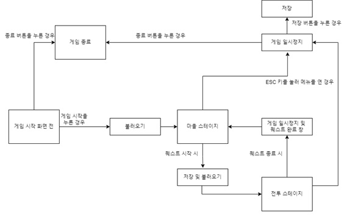
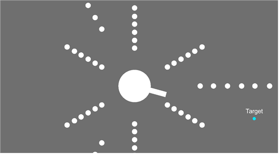
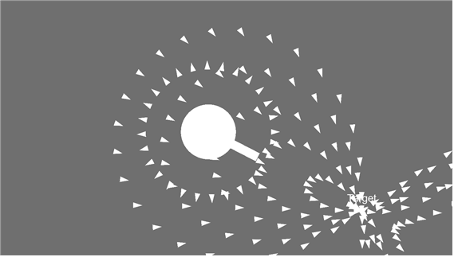
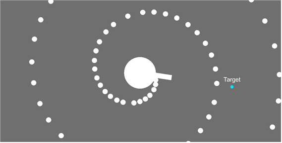
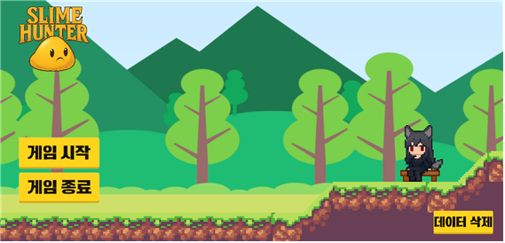
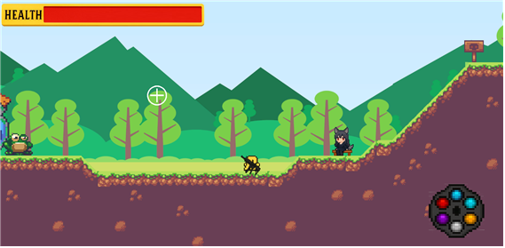
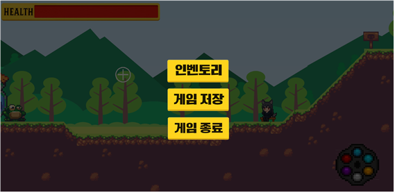
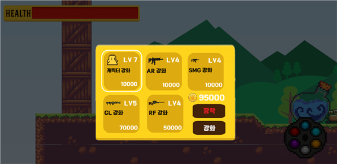
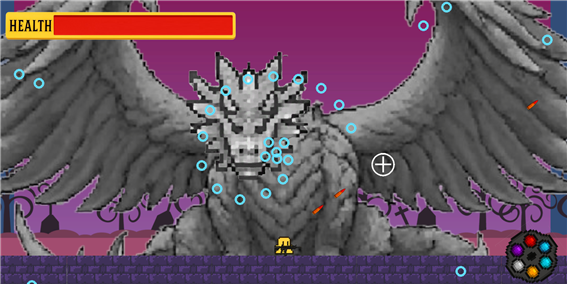

# 유니티를 이용한 2D 횡스크롤 FPS 게임

## 개요
유니티를 활용하여 2D 횡스크롤 FPS 게임을 만들었습니다. 에셋스토어의 무료 에셋과 AI를 이용한 이미지를 에셋으로 활용하였습니다. 

| 하드웨어 환경 | 소프트웨어 환경 |
| --- | --- |
| CPU : Ryzen 7 7800X3D   GPU : NVIDIA GeForce 4060TI 8GB  8Gbps(Memory Speed), Compute Capability 6.1   Memory : 16GB, 2133MHz  저장장치 : HDD | Platform : Unity Version 6000.1.4f   C#: ver 9.0 |

## 주요 유스케이프 명세서
 

<강화 및 무기 변경 유스케이프 명세서>

 
  
| 이름 | 내용 |
| --- | --- |
|유스케이프명|강화|
|액터|플레이어|
|시작 조건|플레이어가 대장간에서 NPC와 상호작용한 경우|
|기본 흐름|1. 플레이어가 대장간에서 플레이어 강화 또는 무기 강화를 클릭한다.  2. 선택 사항을 클릭하고 오른쪽 아래의 강화 버튼을 클릭하면 재화를 사용하여    3. 강화가 진행된다.  4. 무기 강화의 경우 강화 버튼 왼쪽에 무기 장착 버튼이 활성화되며, 클릭 시 무기가 변경된다.|
|대안 흐름|1A  플레이어의 재화가 충분하지 않은 경우 클릭이 활성화되지 않는다.  3A 현재 장착 중인 무기의 경우 무기 장착 버튼이 활성화되지 않는다.|
|종료 조건|플레이어 또는 무기를 강화하면 플레이어의 체력 또는 무기의 공격력이 상승한다.|

  

<아이템 구입 유스케이스 명세서>

 
  
| 이름 | 내용 |
| --- | --- |
|유스케이프명|아이템 구입|
|액터|플레이어|
|시작 조건|플레이어가 상점에서 NPC와 상호작용한 경우|
|기본 흐름|1. 플레이어가 상점에서 아이템을 클릭한다.   2. 아이템의 수랑을 선택한다.    3. 오른쪽 아래의 구입버튼을 클릭하면 재화를 이용하여 구입이 된다.|
|대안 흐름|3A 플레이어의 재화가 충분하지 않은 경우 클릭이 활성화 되지 않는다.|
|종료 조건|플레이어가 아이템을 구입한 경우 아이템이 인벤토리에 들어온다.|

  

<몬스터 패턴 유스케이스 명세서>

 

| 이름 | 내용 |
| --- | --- |
|유스케이프명|몬스터 패턴|
|액터|몬스터|
|시작 조건|플레이어와 전투를 시작할 시|
|기본 흐름|1. 전투 시작 시 플레이어에게 오브젝트를 발사하는 형태의 다양한 패턴의 공격을 한다.  2. 몬스터의 체력이 75%가 되었을 때, 방어막이 생기면서 특수 패턴이 시작된다.  3. 몬스터의 체력이 50%가 되었을 때, 방어막이 생기면서 다른 특수 패턴이 시작된다.  4. 몬스터의 체력이 0이 되면 클리어 화면이 나온다.  5. 클리어 화면에서 우측 하단의 마을로 돌아가기를 클릭하면 마을 스테이지로 이동한다.|
|대안 흐름|2A 일정 시간 동안 공격을 파훼하지 못하면 퀘스트가 실패한다.  3A 일정 시간 동안 공격을 파훼하지 못하면 퀘스트가 실패한다.  5A 몬스터의 체력이 0이 되기 전에 플레이어의 체력이 0이 되면 전체 보상에서 몬스터의 체력에 소비된 비율만큼의 보상을 받는다.|
|종료 조건|전투 종료 시 플레이어의 인벤토리에 보상이 들어온다.|

  

<전투방식 유스케이스 명세서>

 

| 이름 | 내용 |
| --- | --- |
|유스케이프명|전투방식|
|액터|플레이어|
|시작 조건|게임 시작 시|
|기본 흐름|1. 플레이어가 마우스가 위치한 방향으로 총알을 발사한다.  2. 총알이 나아가면서 적 오브젝트 또는 공격 오브젝트에 충돌한 경우에는 삭제된다.  3. 플레이어가 적 오브젝트 또는 공격 오브젝트에 충돌한 경우에는 일정량의 체력이 소모된다.  4. 플레이어의 체력이 0이 되면 사망한다.|
|대안 흐름|2A 공격 오브젝트의 경우 총알의 속성과 공격의 속성을 비교하여 총알의 속성이 우세한 경우 공격의 오브젝트도 같이 사라진다.  3A 플레이어가 무적 판정일 경우에는 체력이 소모되지 않는다.|
|종료 조건|플레이어가 사망하면 마을의 스폰 지점으로 돌아간다.
|
  

## 게임 흐름도

 

## 몬스터 패턴 원리 및 설명
유니티에서 제공하는 mathf()를 사용하여 도형을 구현하였습니다. 원하는 도형의 꼭짓점의 개수를 구하고, 360f에서 꼭짓점 수를 나누게 되면 각 꼭짓점 간의 각도를 구할 수 있습니다. 이를 A라고 가정합니다. 이후 각도 A를 라디안으로 변환 해야하는데, 반복문을 사용하여 각 꼭짓점에 ‘A*Mathf.Deg2Red’를 사용하면 B라는 라디안이 나오게 됩니다. 원의 방정식인 ‘x = Mathf.Cos(B) * 반지름’, ‘y = Mathf.Sin(B) * 반지름’를 이용하여 (x, y)를 구한뒤 ‘vector2(x, y)’를 통해 총알 위치를 설정하면 다양한 탄막을 구현 할 수 있습니다. 

 

<몬스터 탄막 패턴>

## 스크린샷 및 상세 설명

메인화면입니다.

인 게임 화면입니다. 마우스 위치에 십자선이 위치하고 마우스 좌클릭 시 총알이 나갑니다.

일시정지 화면입니다.

상점 화면 입니다.

전투 화면 입니다. 몬스터의 머리를 맞추면 데미지를 입습니다.
